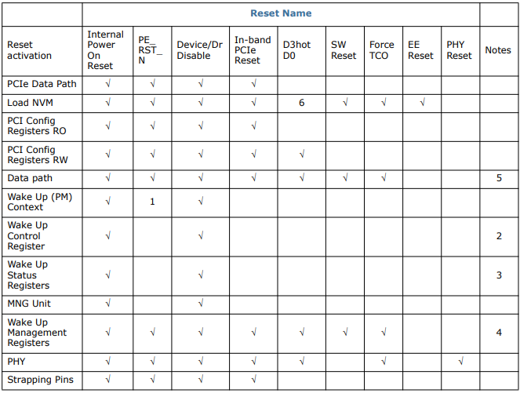

# Intel 82574

For more detail, read the documentation: Intel® 82574 GbE Controller Family Datasheet. In here, I only summarize importation specifications for our driver.

## 1. Initialization

### 1.1. Reset Operation

The 92574L reset sources are as follows:

1. Internal Power On Reset -- once power is up and stable, the 82574 implements an internal reset that acts as a master reset of the entire chip.
2. `PE_RST_N` -- Most units are reset on the rising edge of `PE_RST_N` that bit indicates both power and PCIe clock sources are stable.
3. Device Disable/Dr Disable.
4. In-band PCIe reset -- Generates an internal reset in response to a Physical layer (PHY) message from PCIe or when the PCIe link goes down.
5. D3hotD0 transition -- This is also known as ACPI reset. Generates an internal reset on the transition from D3hot power state to D0.
6. Software Reset -- Software can reset by writing the *Device Reset* bit if the Device Control (`CTRL.RST`) register.
7. Force TCO -- Reset if the *Force TCO* bit of the NVM's Management Control word is 1b.
8. EEPROM Reset -- Writing a 1b to the EEPROM Reset bit of the Extended Device Control (`CTRL_EXT.EE_RST`) register causes device to re-read the configuration from the NVM.
9. PHY Reset -- Software can write a 1b to the PHY Reset bit of the Device Control (CTRL.PHY_RST) register to reset the internal.

The Resets affect the following registers and logic:

In the software reset, device re-reads the per-function NVM fields, and the PCI configuration space (configuration and mapping) of the device is unaffected.

### 1.2. Software initialization sequence

The following sequence of commands is typically issued to the device by the software device driver in order to initialize the 82574 to normal operation. The major initialization steps:

1. Disable Interrupts.
2. Issue Global Reset and perform General Configuration.
3. Setup the PHY and the link.
4. Initialize all statistical counters.
5. Initialize Receive.
6. Initialize Transmit.
7. Enable Interrupts.

#### 1.2.1. Interrupts

Drivers should disable interrupts during initialization to avoid re-entrancy. Interrupts are disabled by writing to the `IMC` register.

After a global reset, the driver need to disable the interrupt again. Like:

1. Disable interrupts.
2. Issue a global reset.
3. Disable interrupts again.
4. Continue init sequence.

After the initialization completes, a typical driver enables the desired interrupts by writing to the `IMS` register.

#### 1.2.2. Global Reset and General Configuration

Several values in the Device Control (`CTRL`) register need to be set at power up or after a device reset for normal operation.

#### 1.2.3. Setup PHY and the link

The device driver uses the `MDIC` register to initialize the PHY and setup the link.

#### 1.2.4. Initialization of statistics

Statistics registers are hardware-initialized to values. All of the statistical counters are cleared on read a typical software device driver reads them.

#### 1.2.5. Receive initialization

1. Program the receive address register(s) per the station address.
2. Setup the multicast table array (MTA) per software, this means zeroing all entries initially and adding in entries as requested.
3. Program the interrupt mask register to pass any interrupt that the software device cares about, for example: `RXT`, `RXO`, `RXDMT`, and `LSC`.
4. Setup the Receive Control register.

For each receive queue:

1. Allocate a region of memory for the receive descriptor list.
2. Receive buffers of appropriate size should be allocated and pointers to these buffers should be stored in the descriptor ring.
3. Program the descriptor base address with the address of the region.
4. Set the length register to the size of descriptor ring.
5. If needed, program the head an tail registers that might be initialized by the hardware to zero after reset.
6. The tail pointer should be set to point one descriptor beyond the end.

#### 1.2.6. Transmit initialization

Program the TXDCTL register with the desired TX descriptor write-back policy.

## 2. Programming Interface

## 3. Driver Programming Interface
